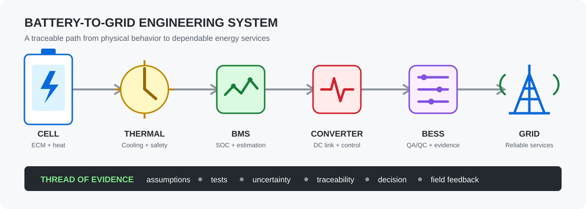
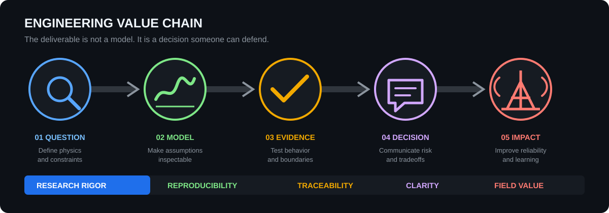
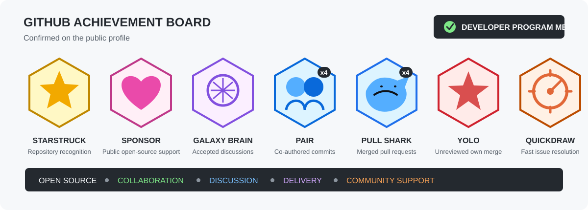

<!-- markdownlint-disable MD001 MD013 MD033 MD041 MD060 -->

 

I turn **battery physics, thermal behavior, and power-system requirements** into
models, validation evidence, and practical engineering decisions. My work spans
lithium-ion battery safety, battery thermal management, real-time state
estimation, BESS quality assurance, and smart-grid integration.

> **Current mission:** build inspectable, reproducible energy-system tools that
> help researchers and engineers move from assumptions to defensible results.

## From Cell Physics To Grid Decisions

| Research and modeling | Deployment and assurance | Technical leadership |
|---|---|---|
| Electro-thermal models, parameter identification, SOC estimation, multiphysics analysis, and validation design. | BESS QA/QC, commissioning evidence, requirement traceability, risk review, and performance verification. | Cross-functional engineering, research translation, technical roadmaps, open-source stewardship, and decision-ready communication. |

## Engineering Value Chain

## Flagship Energy Lab

The
**[MATLAB Simulink Energy Lab](https://github.com/mohammadrezwankhan/matlab-simulink-energy-lab)**
is an open-source collection of inspectable battery and power-electronics
reference models. Each model states its assumptions, validates its behavior, and
connects simulation output to an engineering question.

| Model track | What is demonstrated |
|---|---|
| Battery dynamics | 1RC and 2RC equivalent-circuit models with toolbox-free parameter identification and held-out pulse-profile validation. |
| Thermal management | Lumped electro-thermal, six-cell liquid-cooling, and pouch-cell finite-volume models for heat generation, cooling sensitivity, and spatial nonuniformity. |
| State estimation | A two-state extended Kalman filter for real-time state-of-charge estimation. |
| Power conversion | Average-value converter references with deterministic validation tests. |
| Verification | Twelve base-MATLAB checks and four native Simulink checks verified on MATLAB R2026a. |

**[Explore models](https://github.com/mohammadrezwankhan/matlab-simulink-energy-lab)** |
**[Read release notes](https://github.com/mohammadrezwankhan/matlab-simulink-energy-lab/releases/tag/v0.7.0)** |
**[Open in MATLAB Online](https://matlab.mathworks.com/open/github/v1?repo=mohammadrezwankhan/matlab-simulink-energy-lab)** |
**[Contribute](https://github.com/mohammadrezwankhan/matlab-simulink-energy-lab/blob/main/CONTRIBUTING.md)**

## Selected Engineering Work

| Project | Purpose | Signal |
|---|---|---|
| **[Battery Thermal Modeling Notes](https://github.com/mohammadrezwankhan/battery-thermal-modeling-notes)** | Research-backed guidance on BTMS assumptions, heat generation, temperature behavior, and model validation. |  |
| **[BESS QA/QC Toolkit](https://github.com/mohammadrezwankhan/bess-qaqc-toolkit)** | Inspection logic and evidence templates for utility-scale battery energy storage projects. |  |
| **[Smart Grid Storage Playbook](https://github.com/mohammadrezwankhan/smart-grid-storage-playbook)** | Practical engineering guidance for grid-forming storage, dispatch, and renewable integration. |  |
| **[Battery Power Models](https://github.com/mohammadrezwankhan/battery-power-models)** | Tested MATLAB and Python references for battery thermal response and DC-link sizing. |  |
| **[VoltRL](https://github.com/mohammadrezwankhan/voltrl)** | Power-system and voltage-control engineering experiments. |  |

## Technical Toolbox

**Modeling and analysis**

**Engineering domains**

**Delivery and reproducibility**

## GitHub Achievements

## GitHub Snapshot

## Research Identity

My PhD research at Aalborg University,
**"Thermal Management of Battery Systems in Electric Vehicle and Smart Grid
Application,"** connects battery thermal management, electrical
characterization, and energy-storage control across electric-vehicle and
smart-grid applications.

## Build With Me

I welcome substantive collaboration around battery models, validation datasets,
BESS engineering evidence, and reproducible energy-system research. Good starting
points are the
**[Energy Lab roadmap](https://github.com/mohammadrezwankhan/matlab-simulink-energy-lab#what-should-come-next)**
and its **[open issues](https://github.com/mohammadrezwankhan/matlab-simulink-energy-lab/issues)**.

**Battery insight. Engineering evidence. Grid impact.**

[Website](https://rezwankhan.tech/) |
[LinkedIn](https://www.linkedin.com/in/mohammadrezwankhan) |
[ORCID](https://orcid.org/0000-0002-1532-0598) |
[GitHub Projects](https://github.com/mohammadrezwankhan?tab=repositories)

