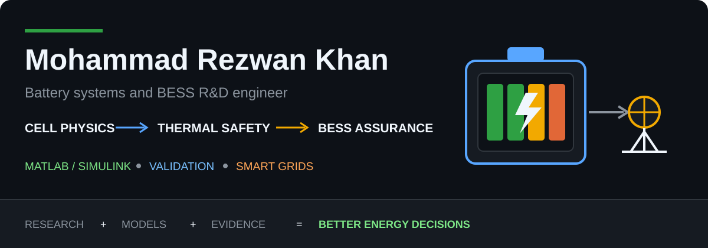

<!-- markdownlint-disable MD013 MD033 MD041 MD060 -->

 

[Portfolio](https://rezwankhan.tech/) ·
[Publications](https://rezwankhan.tech/publications/) ·
[LinkedIn](https://www.linkedin.com/in/mohammadrezwankhan) ·
[ORCID](https://orcid.org/0000-0002-1532-0598)

I turn **battery thermal behavior, power-conversion constraints, and QA
requirements** into auditable engineering decisions. My work connects
lithium-ion battery models, BESS delivery evidence, and smart-grid control from
physical assumptions to reproducible tests.

**Electrical R&D engineer** · **PhD in Energy Technology, Aalborg University** 
**MATLAB/Simulink + Python** · Battery systems · BESS QA/QC · Smart grids

> **Current mission:** build inspectable energy-system tools that help
> researchers and engineers move from assumptions to defensible results.

## Research → Implementation

The DOI anchors the scientific record; the linked repositories expose selected
equations, assumptions, tests, and engineering limits.

| Research record | Open implementation |
|---|---|
| [Thermal Management of Battery Systems in Electric Vehicle and Smart Grid Application](https://doi.org/10.5278/vbn.phd.engsci.00174) — PhD thesis | [Energy Lab](https://github.com/mohammadrezwankhan/matlab-simulink-energy-lab) · [Thermal Modeling Notes](https://github.com/mohammadrezwankhan/battery-thermal-modeling-notes) |
| [An Online Framework for State of Charge Determination of Battery Systems Using a Combined System Identification Approach](https://doi.org/10.1016/j.jpowsour.2013.07.092) — *Journal of Power Sources* | [Battery dynamics and SOC estimation](https://github.com/mohammadrezwankhan/matlab-simulink-energy-lab) |
| [Design of a Unified Controller Framework for Grid-tied and Grid-forming Battery Energy Storage System](https://doi.org/10.1109/IECON49645.2022.9968382) — IEEE IECON | [BESS control models](https://github.com/mohammadrezwankhan/matlab-simulink-energy-lab) · [Grid-service playbook](https://github.com/mohammadrezwankhan/smart-grid-storage-playbook) |

[Browse all 17 publications](https://rezwankhan.tech/publications/) ·
[Verify the ORCID record](https://orcid.org/0000-0002-1532-0598)

## Selected Engineering Work

| Project | Engineering question | Evidence you can inspect |
|---|---|---|
| **[MATLAB Simulink Energy Lab](https://github.com/mohammadrezwankhan/matlab-simulink-energy-lab)** | How do battery, converter, and BESS-control models behave under explicit checks? | Current `main`: 20 Base MATLAB checks; 25 general entry points plus one unified-BESS entry point (26 total); 31-result focused BESS suite; CI; latest tagged release [v0.10.0](https://github.com/mohammadrezwankhan/matlab-simulink-energy-lab/releases/tag/v0.10.0); held-out tests; explicit limitations. |
| **[VoltRL](https://github.com/mohammadrezwankhan/voltrl)** | How should battery arbitrage be benchmarked without information leakage? | Synthetic and historical protocols; regenerated experiments; pinned dependencies; provenance and checksum audits. |
| **[Battery Cycle-Life Analyzer](https://github.com/mohammadrezwankhan/battery-cycle-life-analyzer)** | How can capacity fade and bounded end-of-life be compared transparently? | Installable package; CLI; notebook; external CSV schema; CI and tests; explicit synthetic-demo limits. |
| **[BESS QA/QC Toolkit](https://github.com/mohammadrezwankhan/bess-qaqc-toolkit)** | What evidence is required from supplier review through handover? | FAT/SAT and commissioning templates; executable readiness audits; structured evidence gates. |
| **[Battery Thermal Modeling Notes](https://github.com/mohammadrezwankhan/battery-thermal-modeling-notes)** | Which thermal assumptions and validation checks are defensible? | Source-backed assumptions; reproducible examples; validation checklist; deterministic tests. |
| **[Smart Grid Storage Playbook](https://github.com/mohammadrezwankhan/smart-grid-storage-playbook)** | How do grid-service requests meet power, energy, SoC, frequency, and voltage constraints? | Executable grid-support references; constraint-aware examples; unit tests; documented boundaries. |

**Start here:** the [Energy Lab](https://github.com/mohammadrezwankhan/matlab-simulink-energy-lab)
connects 1RC/2RC battery dynamics, thermal models, SOC estimation, power
conversion, and grid-tied/grid-forming BESS control in one deterministically
regression-tested reference repository with explicit validation limits.

## Project Maturity and Validation

These labels describe the evidence currently published; they are not claims of
hardware qualification, grid-code compliance, or field validation.

| Repository | Lifecycle | Published evidence tier | Stable API | Release/archive |
|---|---|---|---|---|
| Energy Lab | Active reference | Regression-tested; numerically verified; synthetic holdout evaluated | Not applicable | Versioned GitHub releases |
| Battery Cycle-Life Analyzer | Alpha package | Unit-tested; synthetic holdout evaluated | No | Versioned package repository |
| VoltRL | Research artifact | Protocol audited; synthetic and historical backtests | No | Commit-bound result bundles |
| BESS QA/QC Toolkit | Draft toolkit | Parser/test verified; policy checks exercised on reference data | No | Repository snapshots |
| Thermal Modeling Notes | Living handbook | Source-reviewed notes; deterministic examples | Not applicable | Repository snapshots |
| Smart Grid Storage Playbook | Living handbook | Unit-tested reference calculations | Not applicable | Repository snapshots |

**Validation vocabulary:** *unit-tested* means function-level expected behavior;
*regression-tested* means deterministic outputs reproduced in CI; *numerically
verified* means analytic, conservation, or convergence checks; and *synthetic
holdout evaluated* means evaluation on generated unseen profiles. I reserve
*measured-data validated*, *independently replicated*, *HIL/field evaluated*,
and *qualified/certified* for projects that publish evidence meeting those
stronger definitions.

## Selected Upstream Contributions

### Merged

| Upstream project | Contribution |
|---|---|
| [EMHASS](https://github.com/davidusb-geek/emhass) | [PR #1039](https://github.com/davidusb-geek/emhass/pull/1039): added the missing heat-topology guide. |

### Under review

| Upstream project | Contribution |
|---|---|
| [GenX](https://github.com/GenXProject/GenX.jl) | [PR #918](https://github.com/GenXProject/GenX.jl/pull/918): fail fast when a myopic planning stage has no solution. |
| [GitHub Advisory Database](https://github.com/github/advisory-database) | [PR #8819](https://github.com/github/advisory-database/pull/8819): correct a malformed CVSS 4 vector. |

## Open Collaboration Priorities

- Traceable physical-cell datasets and held-out measured validation for battery
  parameter-identification models.
- Validation-based cycle-life model selection with uncertainty intervals for
  end-of-life and remaining-useful-life estimates.
- Reproducible BESS acceptance evidence spanning FAT, SAT, commissioning,
  energization, and handover.

**Core tools:** MATLAB · Simulink · Python · NumPy/SciPy · Jupyter · GitHub Actions 
**Domains:** electro-thermal modeling · BMS/SOC estimation · power electronics ·
BESS assurance · grid-forming control

I welcome substantive collaboration around models, validation datasets, BESS
engineering evidence, and reproducible energy-system research. Start with the
[Energy Lab roadmap](https://github.com/mohammadrezwankhan/matlab-simulink-energy-lab#what-should-come-next)
or a focused [open issue](https://github.com/mohammadrezwankhan/matlab-simulink-energy-lab/issues).

**Battery insight. Engineering evidence. Grid impact.**

[Website](https://rezwankhan.tech/) ·
[LinkedIn](https://www.linkedin.com/in/mohammadrezwankhan) ·
[ORCID](https://orcid.org/0000-0002-1532-0598) ·
[GitHub repositories](https://github.com/mohammadrezwankhan?tab=repositories)

