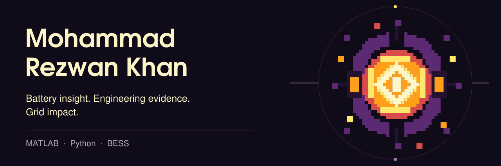
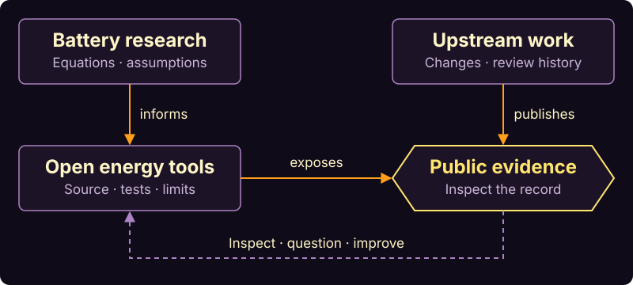
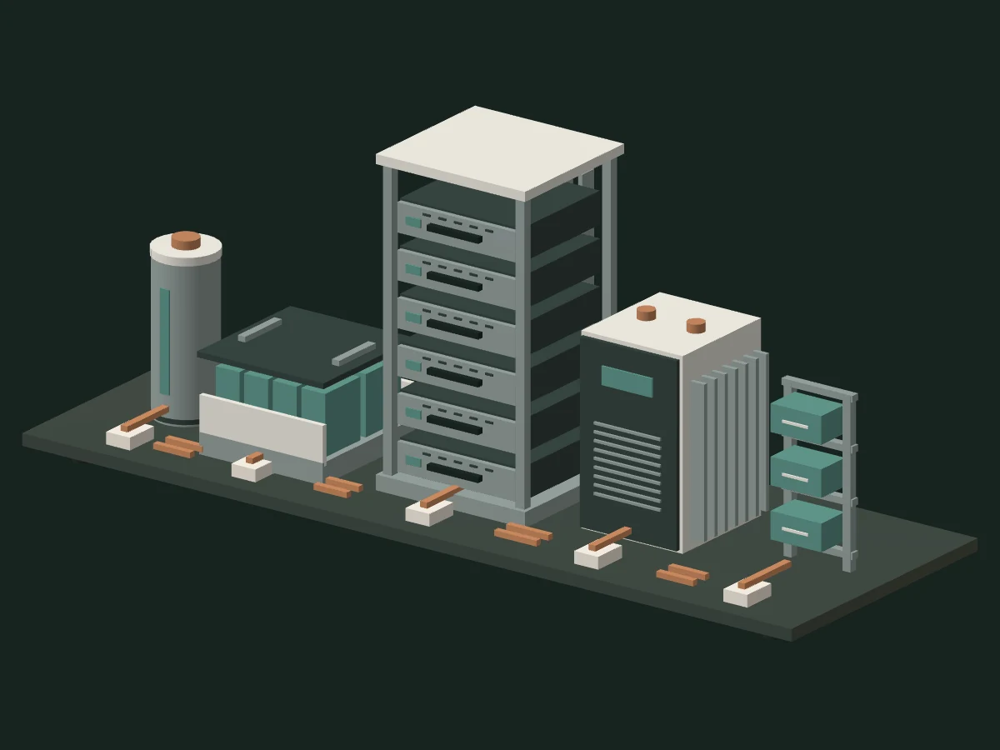
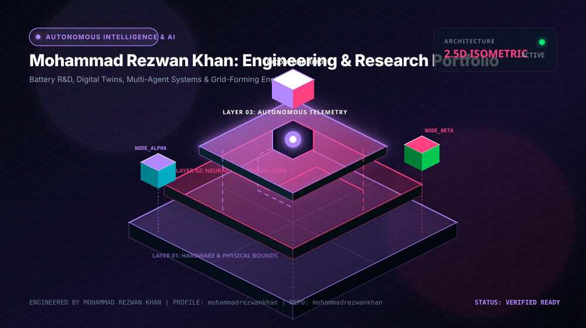
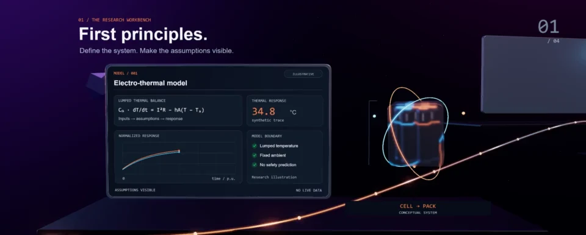

<!-- markdownlint-disable MD013 MD033 MD041 MD060 -->

<picture>
  <source media="(prefers-reduced-motion: reduce)" srcset="assets/makeover/profile-banner-static.svg">
  
</picture>

# Mohammad Rezwan Khan

**Battery insight. Engineering evidence. Grid impact.**

[Portfolio](https://mrkhan.co.technology/) · [Publications](https://mrkhan.co.technology/publications/) · [ORCID](https://orcid.org/0000-0002-1532-0598) · [LinkedIn](https://www.linkedin.com/in/mohammadrezwankhan) · [Motion gallery](https://mohammadrezwankhan.github.io/mohammadrezwankhan/brand/)


I turn **battery thermal behavior, power-conversion constraints, and QA
requirements** into auditable engineering decisions. My work connects
lithium-ion battery models, BESS delivery evidence, and smart-grid control from
physical assumptions to reproducible tests.

**Electrical R&D engineer** · **PhD in Energy Technology, Aalborg University**<br>
**MATLAB/Simulink + Python** · Battery systems · BESS QA/QC · Smart grids

> **Current mission:** build inspectable energy-system tools that help
> researchers and engineers move from assumptions to defensible results.

## Championing engineering you can inspect

Battery research shapes my open energy tools. Upstream contributions put the
same care into shared software. Both leave a public record you can examine.

<picture>
  <source media="(max-width: 600px)" srcset="assets/profile-evidence-circuit-mobile.svg">
  
</picture>

**Read the circuit:** research informs tools; tools and upstream changes expose
evidence; inspection guides the next revision.

[Research record](https://orcid.org/0000-0002-1532-0598) ·
[Energy Lab](https://github.com/mohammadrezwankhan/matlab-simulink-energy-lab) ·
[Verified contribution records](#selected-upstream-contributions)

## Selected Upstream Contributions

**Security advisory credit:** listed as an **Analyst** on
[GHSA-78fc-9688-w8xw / CVE-2026-40076](https://github.com/advisories/GHSA-78fc-9688-w8xw).
My contribution corrected the advisory's machine-readable CVSS 4.0 metadata.

### Merged

| Upstream project | Contribution | Merged |
|---|---|---|
| [GitHub Advisory Database](https://github.com/github/advisory-database) | [PR #8819](https://github.com/github/advisory-database/pull/8819): removed the trailing slash from the malformed CVSS 4.0 vector for [GHSA-78fc-9688-w8xw](https://github.com/advisories/GHSA-78fc-9688-w8xw). | 12 Nov 2026 |
| [Bifrost](https://github.com/maximhq/bifrost) | [PR #6503](https://github.com/maximhq/bifrost/pull/6503): routed OpenCode Responses requests to `/v1/responses`, with regression coverage. | 25 Aug 2026 |
| [Flowsint](https://github.com/reconurge/flowsint) | [PR #217](https://github.com/reconurge/flowsint/pull/217): recognized `@`-prefixed imported usernames while preserving normalization and hash exclusions. | 25 Aug 2026 |
| [EMHASS](https://github.com/davidusb-geek/emhass) | [PR #1039](https://github.com/davidusb-geek/emhass/pull/1039): added the missing heat-topology guide and linked thermal documentation. | 1 Aug 2026 |

<details>
<summary><strong>Open resource-list submissions</strong></summary>

These submissions remain open as of 12 November 2026:

- [awesome-power-analysis #1](https://github.com/anderson-optimization/awesome-power-analysis/pull/1)
- [awesome-MATLAB #48](https://github.com/mikecroucher/awesome-MATLAB/pull/48)
- [awesome-battery-data #2](https://github.com/pauljgasper/awesome-battery-data/pull/2)

</details>

Contribution status checked against authenticated GitHub records on
**12 November 2026**. [Evidence and change record](docs/profile-evidence-2026-11-12.md).

## Start with an engineering question

| Explore | Start here | What you can inspect |
|---|---|---|
| **Battery physics & control** | **[MATLAB Simulink Energy Lab](https://github.com/mohammadrezwankhan/matlab-simulink-energy-lab)** | Battery dynamics, thermal assumptions, SOC estimation, converters, and BESS control. |
| **Capacity fade & model selection** | **[Battery Cycle-Life Analyzer](https://github.com/mohammadrezwankhan/battery-cycle-life-analyzer)** | The Python package, CLI, CSV workflow, and chronological holdout examples. |
| **Acceptance evidence & handover** | **[BESS QA/QC Toolkit](https://github.com/mohammadrezwankhan/bess-qaqc-toolkit)** | FAT/SAT templates, readiness audits, and explicit evidence gates. |
| **Power continuity & finite reserves** | **[Datacenter Twin Lab](https://github.com/mohammadrezwankhan/datacenter-twin-lab)** | Synthetic outage scenarios, energy ledgers, and a [browser demo](https://khanlab.co.technology/). |
| **Storage dispatch & fair comparison** | **[VoltRL](https://github.com/mohammadrezwankhan/voltrl)** | Battery-arbitrage protocols, causal inputs, and reproducible benchmark bundles. |
| **Hybrid-energy assumptions** | **[HelioForge Energy Lab](https://github.com/mohammadrezwankhan/helioforge-energy-lab)** | A Python workbench, scenario calculations, and a [browser preview](https://mkgrid.co.technology/). |

Each project documents its own runtime, evidence, and limits. Start with its README before interpreting results.

**Explore more:** [Grid services](https://github.com/mohammadrezwankhan/smart-grid-storage-playbook) · [Wind-market research](https://github.com/mohammadrezwankhan/zephyrtrade) · [Thermal graph models](https://github.com/mohammadrezwankhan/thermoweave-battery-digital-twin) · [All public repositories](https://github.com/mohammadrezwankhan?tab=repositories)


## Research → Implementation

The DOI anchors the scientific record; the linked repositories expose selected
equations, assumptions, tests, and engineering limits.

| Research record | Open implementation |
|---|---|
| [Thermal Management of Battery Systems in Electric Vehicle and Smart Grid Application](https://doi.org/10.5278/vbn.phd.engsci.00174) — PhD thesis | [Energy Lab](https://github.com/mohammadrezwankhan/matlab-simulink-energy-lab) |
| [An Online Framework for State of Charge Determination of Battery Systems Using a Combined System Identification Approach](https://doi.org/10.1016/j.jpowsour.2013.07.092) — *Journal of Power Sources* | [Battery dynamics and SOC estimation](https://github.com/mohammadrezwankhan/matlab-simulink-energy-lab) |
| [Design of a Unified Controller Framework for Grid-tied and Grid-forming Battery Energy Storage System](https://doi.org/10.1109/IECON49645.2022.9968382) — IEEE IECON | [BESS control models](https://github.com/mohammadrezwankhan/matlab-simulink-energy-lab) · [Grid-service playbook](https://github.com/mohammadrezwankhan/smart-grid-storage-playbook) |

[Browse all 17 publications](https://mrkhan.co.technology/publications/) ·
[Verify the ORCID record](https://orcid.org/0000-0002-1532-0598)

## Open Collaboration Priorities

- Traceable physical-cell datasets and held-out measured validation for battery
  parameter-identification models.
- Validation-based cycle-life model selection with uncertainty intervals for
  end-of-life and remaining-useful-life estimates.
- Reproducible BESS acceptance evidence spanning FAT, SAT, commissioning,
  energization, and handover.

**Core tools:** MATLAB · Simulink · Python · NumPy/SciPy · Jupyter · GitHub Actions<br>
**Domains:** electro-thermal modeling · BMS/SOC estimation · power electronics ·
BESS assurance · grid-forming control

I welcome substantive collaboration around models, validation datasets, BESS
engineering evidence, and reproducible energy-system research. Start with the
[Energy Lab roadmap](https://github.com/mohammadrezwankhan/matlab-simulink-energy-lab#what-should-come-next)
or a focused [open issue](https://github.com/mohammadrezwankhan/matlab-simulink-energy-lab/issues).

## Explore the evidence and learning workspace

[Energy Evidence Atlas](https://mrkhan.co.technology/energy-evidence-atlas/) · [Native-source lesson guide](docs/portfolio/) · [Interactive learning lab](https://mohammadrezwankhan.github.io/mohammadrezwankhan/) · [Previous animations](https://mohammadrezwankhan.github.io/mohammadrezwankhan/animations/) · [MKLab browser demos](https://mklab.co.technology/)

<details>
<summary><strong>Full engineering project descriptions</strong></summary>

## Selected Engineering Work

| Project | Engineering question | Evidence you can inspect |
|---|---|---|
| **[MATLAB Simulink Energy Lab](https://github.com/mohammadrezwankhan/matlab-simulink-energy-lab)** | How do battery, converter, and BESS-control models behave under explicit checks? | Historical [2026-10-06 README snapshot](https://github.com/mohammadrezwankhan/matlab-simulink-energy-lab/blob/5cc54c8c453da6f6e54b514fa83bcfe7a01e48e1/README.md#start-in-60-seconds): 20 Base MATLAB checks, 25 general checks plus one unified-BESS entry point (26 total), and a 31-result focused BESS suite. Earlier release [v0.11.0](https://github.com/mohammadrezwankhan/matlab-simulink-energy-lab/releases/tag/v0.11.0) cites validation at exact source [`c23d7ff`](https://github.com/mohammadrezwankhan/matlab-simulink-energy-lab/tree/c23d7ffd137ee614ea3fdaf4ac4e257a3a1edafe); neither source is a current-`main` validation claim. |
| **[VoltRL](https://github.com/mohammadrezwankhan/voltrl)** | How should battery arbitrage be benchmarked without information leakage? | Synthetic and historical protocols; regenerated experiments; pinned dependencies; provenance and checksum audits. |
| **[HelioForge Energy Lab](https://github.com/mohammadrezwankhan/helioforge-energy-lab)** | How do hybrid-energy assumptions translate into a bounded dispatch and storage calculation? | [Standalone browser preview](https://mkgrid.co.technology/); local Python API; scenario and energy-balance tests; browser/API checks; explicit synthetic-data and screening limits. |
| **[ZephyrTrade](https://github.com/mohammadrezwankhan/zephyrtrade)** | How do wind-forecast and direct-offer strategies change hypothetical revenue? | [Standalone browser preview](https://mktrade.co.business/); reproducible synthetic fixtures; Python/browser numerical parity; Linux CI; no live prices or order execution. |
| **[Battery Cycle-Life Analyzer](https://github.com/mohammadrezwankhan/battery-cycle-life-analyzer)** | How can capacity fade and bounded end-of-life be compared transparently? | Installable package; CLI; notebook; external CSV schema; CI and tests; explicit synthetic-demo limits. |
| **[BESS QA/QC Toolkit](https://github.com/mohammadrezwankhan/bess-qaqc-toolkit)** | What evidence is required from supplier review through handover? | FAT/SAT and commissioning templates; executable readiness audits; structured evidence gates. |
| **[Datacenter Twin Lab](https://github.com/mohammadrezwankhan/datacenter-twin-lab)** | How do utility outages, generator failures, and finite battery reserves affect power continuity? | Local-first Python simulator; [zero-install browser demo](https://khanlab.co.technology/); [24 lessons (12 continuity, 12 infrastructure) and 18 synthetic scenarios](https://github.com/mohammadrezwankhan/datacenter-twin-lab/blob/424cf5349ea1f53d5d207a2d48af689774d878dc/README.md); energy-balance checks; sensitivity analysis and exportable reports. |
| **[Smart Grid Storage Playbook](https://github.com/mohammadrezwankhan/smart-grid-storage-playbook)** | How do grid-service requests meet power, energy, SoC, frequency, and voltage constraints? | Executable grid-support references; constraint-aware examples; unit tests; documented boundaries. |

**Start here:** the [Energy Lab](https://github.com/mohammadrezwankhan/matlab-simulink-energy-lab)
connects 1RC/2RC battery dynamics, thermal models, SOC estimation, power
conversion, and grid-tied/grid-forming BESS control in one deterministically
regression-tested reference repository with explicit validation limits.

</details>

<details>
<summary><strong>Project maturity, validation vocabulary, and historical evidence</strong></summary>

## Project Maturity and Validation

These labels describe the evidence currently published; they are not claims of
hardware qualification, grid-code compliance, or field validation.

| Repository | Lifecycle | Published evidence tier | Stable API | Release/archive |
|---|---|---|---|---|
| Energy Lab | Active reference | Regression-tested; numerically verified; synthetic holdout evaluated | Not applicable | Versioned GitHub releases |
| Battery Cycle-Life Analyzer | Alpha package | Unit-tested; synthetic holdout evaluated | No | Versioned package repository |
| VoltRL | Research artifact | Protocol audited; synthetic and historical backtests | No | Commit-bound result bundles |
| HelioForge Energy Lab | Research preview | Synthetic scenario and conservation checks; Python 3.11–3.13 CI; browser/API tests; no field validation | No | [30 Oct 2026 source release](https://github.com/mohammadrezwankhan/helioforge-energy-lab/releases/tag/cold-load-repair-20261030-a071652), commit `a071652`; synthetic screening limits remain. |
| ZephyrTrade | Research preview | Synthetic backtests; Python 3.11/3.12 CI; browser/native numerical parity; no market-performance validation | No | [2026-09-30 source prerelease](https://github.com/mohammadrezwankhan/zephyrtrade/releases/tag/preview-2026.09.30) |
| BESS QA/QC Toolkit | Draft toolkit | Parser/test verified; policy checks exercised on reference data | No | Repository snapshots |
| Datacenter Twin Lab | Research alpha | Deterministic synthetic scenarios; energy-accounting checks; browser/native output equality; no facility validation | No | [v2.0.1 release](https://github.com/mohammadrezwankhan/datacenter-twin-lab/releases/tag/v2.0.1); [Tests passed on 10 Nov 2026](https://github.com/mohammadrezwankhan/datacenter-twin-lab/actions/runs/42916534472) at [`a92128e`](https://github.com/mohammadrezwankhan/datacenter-twin-lab/commit/a92128eaa85621ccc5691254f32e335a882f0795). |
| Smart Grid Storage Playbook | Living handbook | Unit-tested reference calculations | Not applicable | Repository snapshots |

Release references checked **12 November 2026**. CI results apply to the exact
linked commit. [Earlier release and CI references](docs/profile-evidence-2026-11-12.md#historical-references-retained).

**Validation vocabulary:** *unit-tested* means function-level expected behavior;
*regression-tested* means deterministic outputs reproduced in CI; *numerically
verified* means analytic, conservation, or convergence checks; and *synthetic
holdout evaluated* means evaluation on generated unseen profiles. I reserve
*measured-data validated*, *independently replicated*, *HIL/field evaluated*,
and *qualified/certified* for projects that publish evidence meeting those
stronger definitions.

</details>

<details>
<summary><strong>Energy Evidence Atlas and self-paced learning paths</strong></summary>

## Energy Evidence Atlas

[](https://mrkhan.co.technology/energy-evidence-atlas/)

**Follow an engineering question from the physical system to its source evidence.**

The [Energy Evidence Atlas](https://mrkhan.co.technology/energy-evidence-atlas/) brings
my existing energy projects into a visual reading map, with a searchable project
finder, research-to-code trails, commit-pinned sources and explicit limitations.
The optional 3D assembly is conceptual; it does not represent selected equipment
or establish hardware, facility or grid-code validation.

- [Explore the cell-to-grid system tour](https://mrkhan.co.technology/energy-evidence-atlas/#atlas).
- [Find a model or toolkit](https://mrkhan.co.technology/energy-evidence-atlas/#projects).
- [Read source records and engineering limits](https://mrkhan.co.technology/energy-evidence-atlas/evidence/).
- [Try the bounded reserve calculation](https://mrkhan.co.technology/energy-evidence-atlas/#browser-lab), then open the linked Datacenter Twin Lab for its full documented scenarios.

## Energy learning workspace

Explore the [self-paced learning workspace](https://mrkhan.co.technology/energy-evidence-atlas/#learning) alongside the [cell-to-grid 3D tour](https://mrkhan.co.technology/energy-evidence-atlas/#atlas):

- **Battery & thermal:** [MATLAB Simulink Energy Lab](https://github.com/mohammadrezwankhan/matlab-simulink-energy-lab) and [Battery Cycle-Life Analyzer](https://github.com/mohammadrezwankhan/battery-cycle-life-analyzer).
- **Assurance & continuity:** [BESS QA/QC Toolkit](https://github.com/mohammadrezwankhan/bess-qaqc-toolkit) and [Datacenter Twin Lab](https://github.com/mohammadrezwankhan/datacenter-twin-lab).
- **Dispatch & markets:** [VoltRL](https://github.com/mohammadrezwankhan/voltrl), [HelioForge Energy Lab](https://github.com/mohammadrezwankhan/helioforge-energy-lab), and [ZephyrTrade](https://github.com/mohammadrezwankhan/zephyrtrade).

Progress is self-paced and stored locally in your browser. This workspace offers no certification; synthetic examples are for exploration and do not constitute field validation.

</details>

<details>
<summary><strong>Public browser demos and source records</strong></summary>

## Public browser demo collection

Explore [69 browser demos on MKLab](https://mklab.co.technology/) (catalogue checked 2026-10-17) for energy, learning, civic information and everyday planning. Each app includes usage steps and visible limits.

The new source repositories remain private; the public website provides synthetic browser editions. Use fictional information only. These demos do not establish clinical, legal, financial or emergency-service readiness.

## Public laboratories and historical source snapshots

- **[MKLab](https://mklab.co.technology/)**: Explore public browser demos for energy, learning, civic information and everyday planning. Fictional or synthetic demonstrations, not medical, financial, legal or emergency services. Some source repositories are private.
- **[Intelligent UI](https://mrkhan.co.technology/#intelligent-ui)**: Local, no API; deterministic approved-source routing, no connected AI, and not an engineering approval.
- **[HelioForge Energy Lab](https://mkgrid.co.technology/)**: Explore hybrid-energy architectures, linked lessons and bundled scenario results. The current source includes a bounded 24-hour browser energy-balance Terminal; advanced studies require the local Python application. Check the published build before assuming a hosted capability. Synthetic screening only; no calibrated plant control.
- **[ZephyrTrade](https://mktrade.co.business/)**: Compare wind-market strategies and calculate hypothetical offers from synthetic observations. Synthetic historical data, not live prices, order execution or investment recommendations.
- **[Datacenter Twin Lab](https://khanlab.co.technology/)**: Learn electrical continuity through 24 lessons, including 12 continuity and 12 infrastructure lessons, with 18 synthetic scenarios and inspectable energy ledgers. Uncalibrated synthetic electrical model; not facility safety, certified uptime or live equipment control.

New MKLab additions include [Shomonnoy](https://mklab.co.technology/apps/shomonnoy/), GridLoom Europe, Solmora Grid, Threadmark, Ionweave Control and JolPulse. Use their published synthetic-data boundaries; no operational forecast, charging-control or flood-warning claim is made.

- [battery-power-models](https://github.com/mohammadrezwankhan/battery-power-models/tree/0d8532d478fe7dc5a0da019796cd346786ffdcf0): 6 unit tests in the linked CI run. [CI evidence](https://github.com/mohammadrezwankhan/battery-power-models/actions/runs/35528764843).
- [battery-cycle-life-analyzer](https://github.com/mohammadrezwankhan/battery-cycle-life-analyzer/tree/65df747ccf1ff0d2427ab8ba321b4c6839d0ad3b): 94 passed and 6 skipped tests per Python matrix job. [CI evidence](https://github.com/mohammadrezwankhan/battery-cycle-life-analyzer/actions/runs/36689059076).
- [battery-thermal-modeling-notes](https://github.com/mohammadrezwankhan/battery-thermal-modeling-notes/tree/afef3c2b52ab769fc20b53a07d41e0133c482b67): 84 unit tests in the linked CI run. [CI evidence](https://github.com/mohammadrezwankhan/battery-thermal-modeling-notes/actions/runs/35528751642).
- [voltrl](https://github.com/mohammadrezwankhan/voltrl/tree/a2f7eed0886a5a4844e8db2764c0bfd88615d1d8): 67 benchmark tests; bundle audits are separate checks. [CI evidence](https://github.com/mohammadrezwankhan/voltrl/actions/runs/35528755213).
- [smart-grid-storage-playbook](https://github.com/mohammadrezwankhan/smart-grid-storage-playbook/tree/caf54a81b4d76aa09a2ab8069d343c44e0e5467b): 151 unit tests in the linked CI run. [CI evidence](https://github.com/mohammadrezwankhan/smart-grid-storage-playbook/actions/runs/35528758460).
- [zephyrtrade](https://github.com/mohammadrezwankhan/zephyrtrade/tree/2d5461331a6bf752409e11f3a487700a363bd072): 86 passed tests per Python matrix job. [CI evidence](https://github.com/mohammadrezwankhan/zephyrtrade/actions/runs/36950218335).
- [datacenter-twin-lab](https://github.com/mohammadrezwankhan/datacenter-twin-lab/tree/a01d0d5c79f53726baa6147ef830a12856d97ad9): 150 Python tests per matrix job; 88 browser journeys and 18 export checks are separate suites. [CI evidence](https://github.com/mohammadrezwankhan/datacenter-twin-lab/actions/runs/37106356093).

Source and CI records reviewed 7 October 2026. Counts refer to individual jobs at linked commits, not totals across matrix jobs. [Current portfolio catalogue](https://mrkhan.co.technology/models/#browser-labs).

</details>

<details>
<summary><strong>Complete original repository directory — 12 November 2026 snapshot</strong></summary>

## Public original repository directory

Snapshot checked **12 November 2026**: **12 owned public originals**, including this profile. This active directory excludes forks and private repositories. It is separate from the browser-demo catalogue and historical upstream contributions above. [Browse the live repository list](https://github.com/mohammadrezwankhan?tab=repositories). Source and workflow evidence apply to their linked revisions.

| Original repository | Engineering question | Start here |
|---|---|---|
| [battery-cycle-life-analyzer](https://github.com/mohammadrezwankhan/battery-cycle-life-analyzer) | How does chronological holdout affect model selection? | [README and setup](https://github.com/mohammadrezwankhan/battery-cycle-life-analyzer/blob/main/README.md) |
| [battery-power-models](https://github.com/mohammadrezwankhan/battery-power-models) | How do simple electrical and thermal reference calculations behave? | [README and setup](https://github.com/mohammadrezwankhan/battery-power-models/blob/main/README.md) |
| [battery-thermal-modeling-notes](https://github.com/mohammadrezwankhan/battery-thermal-modeling-notes) | How do heat balance and integration assumptions affect one-node temperature? | [README and setup](https://github.com/mohammadrezwankhan/battery-thermal-modeling-notes/blob/main/README.md) |
| [bess-qaqc-toolkit](https://github.com/mohammadrezwankhan/bess-qaqc-toolkit) | Which fictional review records lack required evidence? | [README and setup](https://github.com/mohammadrezwankhan/bess-qaqc-toolkit/blob/main/README.md) |
| [datacenter-twin-lab](https://github.com/mohammadrezwankhan/datacenter-twin-lab) | When does a finite reserve run out during an outage? | [README and setup](https://github.com/mohammadrezwankhan/datacenter-twin-lab/blob/main/README.md) |
| [helioforge-energy-lab](https://github.com/mohammadrezwankhan/helioforge-energy-lab) | How do hybrid-energy assumptions change a bounded energy balance? | [README and setup](https://github.com/mohammadrezwankhan/helioforge-energy-lab/blob/main/README.md) |
| [matlab-simulink-energy-lab](https://github.com/mohammadrezwankhan/matlab-simulink-energy-lab) | How do battery, thermal, converter and BESS teaching models behave? | [README and setup](https://github.com/mohammadrezwankhan/matlab-simulink-energy-lab/blob/main/README.md) |
| [mohammadrezwankhan](https://github.com/mohammadrezwankhan/mohammadrezwankhan) | Which original project addresses the engineering question? | [README and setup](https://github.com/mohammadrezwankhan/mohammadrezwankhan/blob/main/README.md) |
| [smart-grid-storage-playbook](https://github.com/mohammadrezwankhan/smart-grid-storage-playbook) | Which power, energy or reserve constraint makes a request infeasible? | [README and setup](https://github.com/mohammadrezwankhan/smart-grid-storage-playbook/blob/main/README.md) |
| [thermoweave-battery-digital-twin](https://github.com/mohammadrezwankhan/thermoweave-battery-digital-twin) | How do spatial cooling boundaries change a synthetic thermal graph? | [README and setup](https://github.com/mohammadrezwankhan/thermoweave-battery-digital-twin/blob/main/README.md) |
| [voltrl](https://github.com/mohammadrezwankhan/voltrl) | How do causal information and fair baselines affect battery-arbitrage research? | [README and setup](https://github.com/mohammadrezwankhan/voltrl/blob/main/README.md) |
| [zephyrtrade](https://github.com/mohammadrezwankhan/zephyrtrade) | How do forecast and decision assumptions affect synthetic settlement costs? | [README and setup](https://github.com/mohammadrezwankhan/zephyrtrade/blob/main/README.md) |

</details>

<details>
<summary><strong>Original four-module profile guide and previous animations</strong></summary>



The profile connects research, open implementations, validation vocabulary, and upstream contributions. A small synthetic battery exercise introduces the evidence questions used to choose a project.

**[Native-source lesson guide](docs/portfolio/) · [Offline interactive lab](docs/index.html) · [Lesson configuration](docs/lesson-config.json) · [Configuration schema](docs/lesson-config.schema.json) · [Portfolio at rezwankhan.tech](https://rezwankhan.tech)**

## Previous animations

[Open the live lab](https://mohammadrezwankhan.github.io/mohammadrezwankhan/) → **Previous animations** · [Open the local gallery](docs/animations/index.html)

Earlier animated artwork, waveform demos, and original interactive experiences are linked alongside the current animations.

## Choose a project by the engineering question

| Question | Start with the native example |
|---|---|
| How does a late-cycle holdout change a battery-life fit? | [battery-cycle-life-analyzer](https://github.com/mohammadrezwankhan/battery-cycle-life-analyzer/blob/main/README.md) |
| How long can a finite battery reserve supply an outage? | [datacenter-twin-lab](https://github.com/mohammadrezwankhan/datacenter-twin-lab/blob/main/README.md) |
| How do current pulses affect terminal voltage and SOC? | [matlab-simulink-energy-lab](https://github.com/mohammadrezwankhan/matlab-simulink-energy-lab/blob/main/README.md) |
| Which evidence is missing before a fictional BESS handover? | [bess-qaqc-toolkit](https://github.com/mohammadrezwankhan/bess-qaqc-toolkit/blob/main/README.md) |

Each repository states its runtime, synthetic inputs and validation limits. The profile exercise below is a separate teaching aid.

## Your first interactive result

1. Download or clone this repository and open `docs/index.html` in a modern browser.
2. Select **Module 1**, apply its preset, and compare the declared checkpoint with the plotted result.
3. Change one slider, inspect the model assumptions, then export the configuration or telemetry for your notes.

The browser lab runs offline with no packages, accounts, or live data feeds. Its numbers are deterministic teaching simulations. Each checkpoint states its model time and tolerance; passing it demonstrates agreement with that model, not field calibration or production readiness.

## Four-module learning path

| Module | Investigation | Approximate time |
|---|---|---:|
| 1. Turn a battery question into an evidence route | Use units and scope to select a relevant project from the profile. | 12 min |
| 2. Find the energy-inventory boundary | Recognize that an apparently steady current request cannot continue after depletion. | 15 min |
| 3. Separate scale from validation | Explain how a capacity change affects duration without validating a larger physical pack. | 15 min |
| 4. Create an evidence-led project brief | Write a reproducible study question with a clear evidence tier and source of record. | 18 min |

**Who this is for:** Researchers, students, collaborators, and engineers finding a relevant model or evidence workflow.

### Continue into the implementation

- [README.md](README.md)
- [CONTRIBUTING.md](CONTRIBUTING.md)
- [LICENSE](LICENSE)

### Explore or run the source

No native runtime: this is a profile and evidence directory. Follow each linked repository’s own setup instructions.

```bash
git show HEAD:README.md
git show HEAD:CONTRIBUTING.md
```

These commands inspect files in this profile repository. The standalone browser
lab is a separate teaching exercise; it does not execute MATLAB, Python, or the
linked projects' numerical engines. Follow each project's own README for its
runtime, licence, installation steps, and scientific limits.

</details>

<details>
<summary><strong>Earlier identity artwork and profile links</strong></summary>

[Open the original full-motion artwork](assets/engineering-hero.gif). The still preview below keeps this profile lightweight.

<div align="center">

<h1>Mohammad Rezwan Khan</h1>

<a href="https://mrkhan.co.technology/">
  <picture>
    <source media="(prefers-reduced-motion: reduce)" srcset="./assets/engineering-hero-v2.webp">
    
  </picture>
</a>

<sub>Physics → models → evidence → energy systems. Illustrative; no live data.</sub>

<br>

[Portfolio](https://mrkhan.co.technology/) ·
[Publications](https://mrkhan.co.technology/publications/) ·
[LinkedIn](https://www.linkedin.com/in/mohammadrezwankhan) ·
[ORCID](https://orcid.org/0000-0002-1532-0598)

</div>

</details>

<div align="center">

**Battery insight. Engineering evidence. Grid impact.**

[Website](https://mrkhan.co.technology/) ·
[LinkedIn](https://www.linkedin.com/in/mohammadrezwankhan) ·
[ORCID](https://orcid.org/0000-0002-1532-0598) ·
[GitHub repositories](https://github.com/mohammadrezwankhan?tab=repositories)

</div>

---

[Original profile snapshot](README.before-makeover-2026-11-08.md) · [Visual assets and motion controls](https://mohammadrezwankhan.github.io/mohammadrezwankhan/brand/) · [Design research and change record](docs/profile-makeover-2026-11-08.md)

The energy-core motion is illustrative artwork; it does not display live telemetry.

